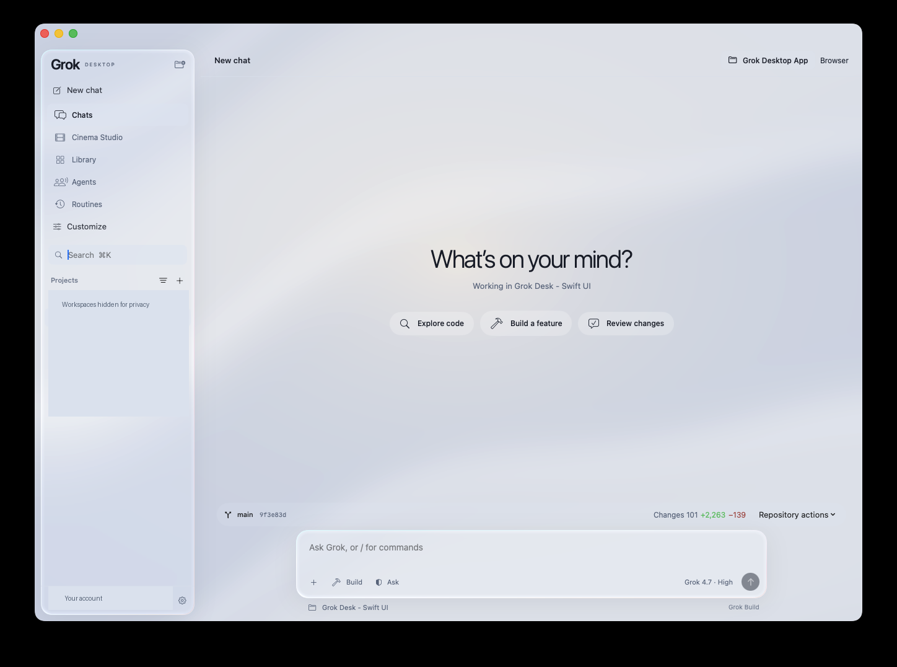
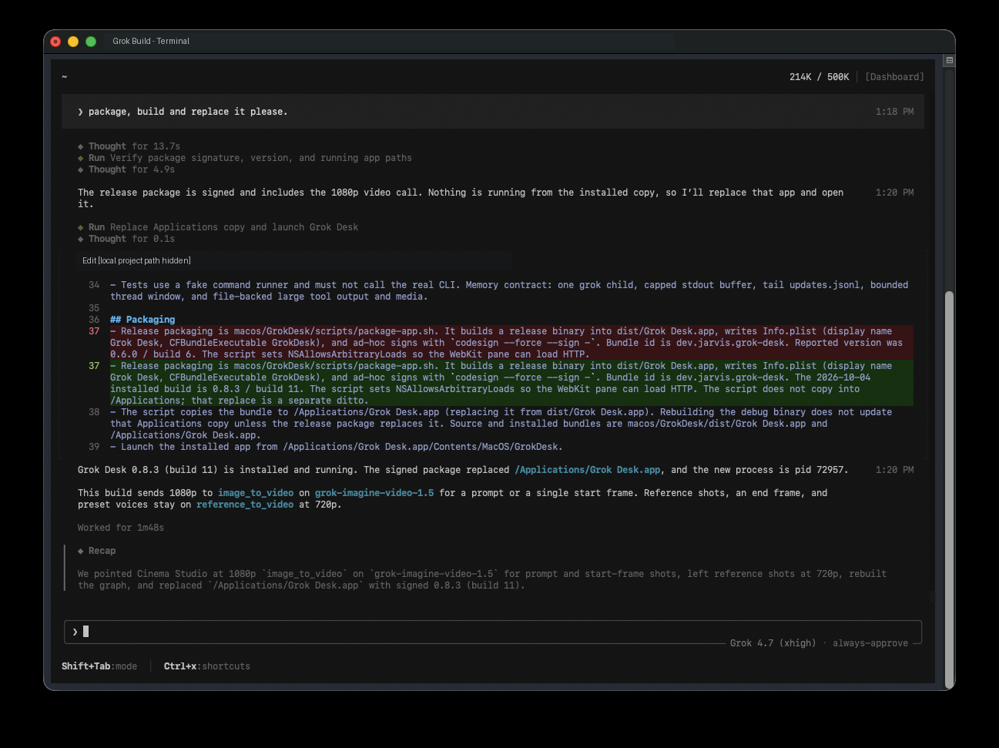
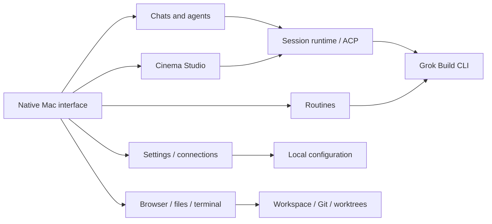

<div align="center">

# Grok Desk
### Give Grok Build a desktop.

**Projects, coding agents, and a cinema studio—in one native Mac app.**

[**Download for Apple Silicon ↓**](https://github.com/nickgaiski/grok-desk/releases/download/v0.8.6-preview/Grok-Desk-0.8.6-preview.dmg) · [Release notes & checksum](https://github.com/nickgaiski/grok-desk/releases/tag/v0.8.6-preview) · [Grok Build CLI docs](https://docs.x.ai/build/overview)

  

</div>



*Actual app screenshot. Personal workspace names and account details are masked.*

**Free, open-source client. Bring your own Grok Build installation and account.** This is an independent project, not an official xAI app. The current download is an **unnotarized Apple Silicon preview**; macOS requires a manual first-launch approval. Intel users can try building from source; no Intel binary is provided.

## Why I built this

I liked what Grok could do. I hated managing it through a TUI in Terminal.

I wanted to see my projects, switch between sessions, follow agents, and work with files without keeping everything in my head—or in terminal tabs. So I built the visual Mac app I wanted to use.

There was a second reason: I already pay good money for SuperGrok Heavy. I wanted to put that subscription to work for image and video creation, with the goal of replacing my separate Higgsfield subscription. That became Cinema Studio: a visual place for prompts, references, camera settings, and generated media.

That is the ambition behind Grok Desk, not a claim of Higgsfield feature parity or unlimited generation. Available models, media tools, subscription eligibility, and usage limits are determined by Grok and your account.

<details>
<summary><strong>Before: the terminal workflow that started it</strong></summary>



*Actual development screenshot, with the personal title and local project path masked. Transcript text reflects that development session, not current release guarantees.*

</details>

## One place to build, create, and keep track

| Workspace | What you can do |
| --- | --- |
| **Projects & chats** | Group sessions by workspace, expand and collapse projects, search, choose folders, and resume work. Send with Enter; paste images and files into the composer. |
| **Cinema Studio** | Switch between Image, Video, and a separate media-agent canvas. Select references, first/last frames, aspect ratio, duration, resolution, audio, camera presets, lens, focal length, aperture, and camera movement. Save boards and browse media. |
| **Agents & queues** | See work states and reported child-agent activity, inspect active work, and queue follow-up prompts while a turn is running. |
| **Browser, files & terminal** | Open web panels, browse and edit workspace files, and use an embedded terminal. Configure an external Chromium-browser connection through the Playwright extension/MCP integration. |
| **Git & worktrees** | Inspect branch/commit and changed files; review commands for staging, commits, pushes, draft PRs, branches, merges, and configured deployment scripts. Create isolated worktrees. |
| **Routines** | Create recurring local jobs and inspect run history. An optional helper supports scheduling while the app is closed and the Mac is awake and logged in. |
| **Plugins & connections** | Discover plugins and skills, review installs, manage connections, authorize or reconnect providers, and see connection health. |
| **Settings that feel like an app** | Edit configuration in a form or code view, add connections, save with validation and a restart prompt, edit project rules, and inspect account/usage information. |
| **Native glass, your way** | Light and dark appearance, moving lighting, refraction, a live glass-settings preview, styled sliders, reduced-motion support, and a simpler Performance Mode. |

### A studio for the subscription you already use

Cinema Studio gives media creation its own space instead of overloading the coding chat. The reference picker brings together generations, uploads, audio, and references; the media agent uses its own canvas workflow.

Video controls include 480p/720p/1080p and duration choices. The current integration routes prompt-only or single-start-frame shots separately from reference/end-frame/voice workflows; reference workflows are capped at 720p. Actual tool availability and output depend on the installed Grok version and account. Audio-off can remove the audio track from the app’s saved copy when the provider tool lacks a silent-generation option.

### Know what is native—and what opens Grok

This is working preview software, still being refined. Plan review, provider-wide dashboard sessions, and background-task views can open the official Grok terminal interface. External browser control requires separate setup and browser approval. Git PR actions require an authenticated `gh` CLI; deployment requires a detected project script. Routines do not wake a sleeping Mac. Not every feature has been live-tested against every provider or account.

## Get started

1. **[Download the Mac preview](https://github.com/nickgaiski/grok-desk/releases/download/v0.8.6-preview/Grok-Desk-0.8.6-preview.dmg)** and drag Grok Desk into Applications.
2. **Follow the included First launch guide.** The DMG contains Privacy & Security and System Settings shortcuts. It cannot approve itself and does not change macOS security settings. [Apple’s guidance](https://support.apple.com/en-us/102445).
3. **Install and sign in to Grok Build** using the [official CLI documentation](https://docs.x.ai/build/overview). The DMG does not install the CLI or include login credentials.
4. **Choose your workspace** and start a chat—or open Cinema Studio to create.

[Download checksum and release details →](https://github.com/nickgaiski/grok-desk/releases/tag/v0.8.6-preview)

## Build on it

Grok Desk is a SwiftUI/AppKit client around Grok Build. The public repository contains source and tests, not a second copy of your account or conversations.



**[Explore the architecture and feature-to-source map →](docs/architecture/README.md)**

Includes a downloadable, self-contained node explorer and a sanitized Graphify-derived JSON graph: **76 source-file nodes and 91 observed cross-file relationships**. The graph excludes private documentation, transcripts, source snippets, absolute paths, and original graph metadata. It is an orientation aid, not a complete call graph.

<details>
<summary><strong>Build, test, and package from source</strong></summary>

Requires macOS 14+, Xcode with Swift 6 and the Metal compiler/toolchain, and a separately installed Grok Build CLI. Native system glass is used on macOS 26 where available.

```sh
git clone https://github.com/nickgaiski/grok-desk.git
cd grok-desk
bash scripts/build-shaders.sh
swift build
swift run GrokDesk
```

```sh
swift test
bash scripts/package-app.sh
bash scripts/package-dmg.sh
```

Packaging creates an ad-hoc-signed application and preview DMG in `dist/`. It does not notarize the app. Set `GROK_APP_ICON` to an `.icns` file for an optional custom icon. Install Xcode’s Metal toolchain if shader compilation reports it missing.

</details>

## Help shape the next version

Found a rough edge? **[Report a bug](https://github.com/nickgaiski/grok-desk/issues/new)** with your macOS version, app version, and steps to reproduce. Remove account details, paths, prompts, and credentials from screenshots and logs first.

Want to contribute? Start with the [architecture map](docs/architecture/README.md), keep changes focused, and test the actual workflow. UI polish, accessibility, onboarding, and provider compatibility are useful areas to improve. If this is the interface you wanted for Grok, star the repo to follow its progress.

## Privacy & license

Your Grok account, sessions, and configuration are loaded locally at runtime. Prompts and tool activity can reach Grok or connected services when you use those features; this is not an offline model. Review tool permissions before enabling connections or unattended routines.

[MIT license](LICENSE) · [Third-party notices](docs/THIRD-PARTY-NOTICES.txt) · [Public graph security notes](docs/architecture/SECURITY.md)

Grok Desk is unofficial and is not affiliated with or endorsed by xAI or Higgsfield. Third-party trademarks belong to their respective owners.
